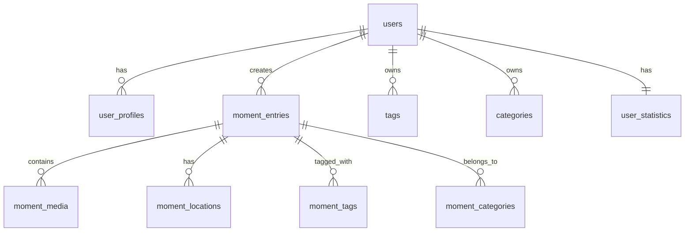

# OneMoment+ 프로젝트 가이드

## 📱 프로젝트 개요

**OneMoment+**는 일상의 소중한 순간을 기록하는 Flutter 기반의 개인 일기 앱입니다. 사진, 텍스트, 위치 정보를 포함한 멀티미디어 일기를 작성하고 관리할 수 있습니다.

### 🎯 주요 기능
- 🔐 **사용자 인증**: 이메일 로그인, 회원가입, 게스트 모드
- 📝 **일기 작성**: 텍스트, 이미지, 위치 정보를 포함한 멀티미디어 일기
- 📅 **타임라인**: 시간순으로 정렬된 일기 조회
- 🏷️ **태그 및 카테고리**: 일기 분류 및 검색 최적화
- 😊 **기분 추적**: 일일 감정 상태 기록 및 분석
- 📊 **통계 및 분석**: 작성 패턴, 기분 변화 등 개인 인사이트
- 🔔 **알림 시스템**: 일기 작성 리마인더
- 💾 **백업 및 동기화**: 데이터 안전성 보장
- 🔒 **프라이버시**: Row Level Security로 개인정보 보호
- 📴 **오프라인 모드**: 네트워크 오류 시 graceful 처리

## 🏗️ 기술 스택

### Frontend
- **Flutter** 3.0+ (Dart)
- **Material Design** UI 컴포넌트
- **State Management**: StatefulWidget 기반

### Backend & Database
- **Supabase** (PostgreSQL + Auth + Storage + Real-time)
- **Row Level Security (RLS)** 적용
- **실시간 데이터 동기화**

### 주요 패키지
- `supabase_flutter: ^2.3.4` - 백엔드 연동
- `image_picker: ^1.0.4` - 카메라/갤러리 접근
- `google_maps_flutter: ^2.5.0` - 지도 및 위치 서비스
- `permission_handler: ^11.1.0` - 권한 관리
- `shared_preferences: ^2.2.2` - 로컬 설정 저장
- `path_provider: ^2.1.1` - 파일 시스템 접근

## 📁 프로젝트 구조

```
lib/
├── main.dart                           # 앱 진입점
├── config/
│   └── supabase_config.dart           # Supabase 설정
├── models/
│   └── moment_entry.dart              # 데이터 모델
├── services/
│   ├── moment_service.dart            # 일기 CRUD 서비스
│   └── database_migration_service.dart # DB 마이그레이션
├── screens/
│   ├── auth/
│   │   └── login_screen.dart          # 로그인/회원가입 화면 ✅
│   ├── home_screen.dart               # 홈 화면
│   ├── timeline_screen.dart           # 타임라인 화면
│   ├── info_screen.dart               # 정보 화면
│   ├── settings_screen.dart           # 설정 화면
│   └── admin/
│       └── database_admin_screen.dart # 데이터베이스 관리
├── utils/
│   ├── connectivity_helper.dart       # 네트워크 연결 확인 ✅
│   └── database_setup_helper.dart     # DB 설정 유틸리티
└── widgets/
    └── auth_wrapper.dart              # 인증 상태 관리 ✅

assets/
├── images/                            # 이미지 에셋
└── complete_database_schema.sql       # 완전한 DB 스키마

docs/
├── 데이터베이스설계.md                # 데이터베이스 설계 가이드
├── SUPABASE_SETUP.md                  # Supabase 설정 가이드
├── complete_database_schema.sql       # 전체 스키마 파일
└── test_database_schema.sql          # 스키마 테스트 파일
```

## 🗄️ 데이터베이스 설계

### ERD 개요
총 13개 테이블로 구성된 완전한 데이터베이스 스키마:



### 핵심 테이블
1. **moment_entries**: 일기 엔트리 (제목, 내용, 기분, 날씨 등)
2. **moment_media**: 멀티미디어 파일 (이미지, 비디오, 오디오)
3. **moment_locations**: 위치 정보 (GPS, 주소, 장소명)
4. **tags**: 사용자 정의 태그 시스템
5. **categories**: 카테고리 분류 시스템
6. **user_profiles**: 사용자 상세 정보
7. **user_statistics**: 사용자 통계 및 분석 데이터
8. **mood_tracking**: 기분 추적 로그
9. **notifications**: 알림 시스템
10. **backup_sessions**: 백업 관리
11. **sync_logs**: 동기화 로그

## 🚀 개발 환경 설정

### 1. 사전 요구사항
```bash
# Flutter 설치 확인
flutter doctor

# 프로젝트 의존성 설치
flutter pub get

# iOS 설정 (macOS에서만)
cd ios && pod install
```

### 2. Supabase 설정
1. [Supabase 대시보드](https://supabase.com) 접속
2. 새 프로젝트 생성
3. `lib/config/supabase_config.dart`에 프로젝트 URL과 API 키 설정
4. SQL Editor에서 `complete_database_schema.sql` 실행

### 3. 환경별 실행
```bash
# 개발 모드
flutter run

# 릴리즈 모드
flutter run --release

# iOS 빌드
flutter build ios

# Android 빌드
flutter build apk
```

## 🛠️ 주요 명령어

### 개발 명령어
```bash
# 프로젝트 클린
flutter clean && flutter pub get

# 의존성 업데이트
flutter pub upgrade

# 코드 분석
flutter analyze

# 테스트 실행
flutter test
```

### 데이터베이스 관리
앱 내 **설정 → 개발자 도구 → 데이터베이스 관리**에서:
- 데이터베이스 상태 확인
- 완전한 스키마 설정
- 단계별 테이블 생성
- 기존 데이터 마이그레이션

### 빌드 및 배포
```bash
# iOS 빌드 (코드사인 없이)
flutter build ios --no-codesign

# Android APK 빌드
flutter build apk --release

# 앱 번들 빌드 (Google Play)
flutter build appbundle
```

## 📱 화면별 기능

### 1. 인증 화면 (`auth/login_screen.dart`) - ✅ 완성 (2025-07-01)
- 이메일/비밀번호 로그인
- 회원가입 (자동 프로필 생성)
- 게스트 로그인 (익명 인증)
- 네트워크 연결 상태 확인
- 사용자 친화적 오류 처리

### 2. 홈 화면 (`home_screen.dart`)
- 오늘의 일기 작성
- 최근 일기 미리보기
- 빠른 기분 기록

### 3. 타임라인 화면 (`timeline_screen.dart`)
- 시간순 일기 목록
- 검색 및 필터링
- 무한 스크롤 페이징

### 4. 정보 화면 (`info_screen.dart`)
- 유용한 링크 관리
- 외부 콘텐츠 연동
- 개인 북마크

### 5. 설정 화면 (`settings_screen.dart`)
- 앱 환경 설정
- 알림 설정
- 백업/복원
- 개발자 도구 접근

### 6. 데이터베이스 관리 (`database_admin_screen.dart`)
- 스키마 생성 및 관리
- 마이그레이션 실행
- 데이터베이스 상태 모니터링

## 🔧 주요 서비스

### AuthWrapper (`widgets/auth_wrapper.dart`) - ✅ 완성 (2025-07-01)
```dart
// 인증 상태 자동 관리
// - 로그인 상태 확인
// - 인증 상태 변화 리스닝
// - 로그인/로그아웃 화면 자동 전환
// - 로딩 상태 처리
```

### LoginScreen (`screens/auth/login_screen.dart`) - ✅ 완성 (2025-07-01)
```dart
// 회원가입
await _supabase.auth.signUp(email: email, password: password);

// 로그인
await _supabase.auth.signInWithPassword(email: email, password: password);

// 게스트 로그인
await _supabase.auth.signInAnonymously();

// 자동 프로필 생성
await _createUserProfile(user);
```

### ConnectivityHelper (`utils/connectivity_helper.dart`) - ✅ 신규 (2025-07-01)
```dart
// 인터넷 연결 확인
final hasInternet = await ConnectivityHelper.checkInternetConnection();

// Supabase 서버 연결 확인
final hasSupabase = await ConnectivityHelper.checkSupabaseConnection();

// 연결 문제 다이얼로그 표시
ConnectivityHelper.showConnectionDialog(context, onRetry);
```

### MomentService (`moment_service.dart`)
```dart
// 일기 생성
await MomentService.createMoment(momentEntry);

// 일기 조회
final moments = await MomentService.getAllMoments();

// 일기 검색
final results = await MomentService.searchMoments(query);

// 일기 업데이트
await MomentService.updateMoment(id, momentEntry);

// 일기 삭제
await MomentService.deleteMoment(id);
```

### DatabaseSetupHelper (`database_setup_helper.dart`)
```dart
// 전체 스키마 설정
await DatabaseSetupHelper.setupCompleteSchema();

// 단계별 테이블 생성
await DatabaseSetupHelper.createTablesStepByStep();

// 기존 데이터 마이그레이션
await DatabaseSetupHelper.migrateExistingData();

// 데이터베이스 상태 확인
await DatabaseSetupHelper.checkDatabaseStatus();
```

## 🔒 보안 및 권한

### Row Level Security (RLS) 정책
- 모든 테이블에 RLS 활성화
- 사용자별 데이터 격리
- 개인정보 보호 강화

### 권한 관리
- 카메라/갤러리 접근 권한
- 위치 서비스 권한
- 파일 시스템 접근 권한
- 알림 권한

## 📊 성능 최적화

### 데이터베이스 최적화
- 검색용 GIN 인덱스 적용
- 복합 인덱스로 쿼리 성능 향상
- 자동 통계 업데이트 트리거

### 앱 성능
- 이미지 최적화 및 캐싱
- 페이징으로 메모리 사용량 최적화
- 비동기 데이터 로딩

## 🐛 트러블슈팅

### 일반적인 문제
1. **Supabase 연결 실패**
   - `supabase_config.dart`의 URL과 API 키 확인
   - 네트워크 연결 상태 확인
   - 방화벽 설정 확인

2. **빌드 오류**
   ```bash
   flutter clean
   flutter pub get
   cd ios && pod install  # iOS만
   ```

3. **권한 거부**
   - `permission_handler` 설정 확인
   - 플랫폼별 권한 설정 검토

### 네트워크 관련 문제
1. **인증 실패 (AuthRetryableFetchException)**
   - 인터넷 연결 확인
   - DNS 설정 확인
   - 앱은 오프라인 모드로 계속 사용 가능

2. **데이터 로드 실패**
   - 화면 상단의 "재연결" 버튼 사용
   - 타임라인에서 아래로 당겨서 새로고침

3. **오프라인 모드**
   - 네트워크 연결 시 자동으로 온라인 모드 전환
   - 오프라인 상태에서는 데이터 저장 제한

4. **macOS "Operation not permitted" 오류 (2025-07-01 해결)**
   - macOS entitlements 파일에 네트워크 클라이언트 권한 추가
   - iOS Info.plist에 App Transport Security 예외 설정
   - ConnectivityHelper를 통한 네트워크 연결 상태 사전 확인
   - 방화벽/VPN 설정 확인 필요

### 데이터베이스 문제
1. **테이블 없음 오류**
   - 앱 내 데이터베이스 관리에서 스키마 설정 실행

2. **RLS 정책 오류**
   - Supabase 대시보드에서 Authentication 설정 확인

3. **사용자 데이터 격리**
   - 익명 로그인으로 사용자별 데이터 분리
   - 다른 기기에서는 다른 데이터 표시됨

## 📈 향후 계획

### Phase 1: 기본 기능 완성
- ✅ 일기 CRUD 기능
- ✅ 멀티미디어 지원
- ✅ 데이터베이스 스키마 완성
- ✅ 사용자 인증 시스템 완성 (2025-07-01)

### Phase 2: 고급 기능
- 🔄 실시간 동기화
- 📱 푸시 알림
- 🤖 AI 기반 기분 분석

### Phase 3: 확장 기능
- 🌐 소셜 공유
- 📤 데이터 내보내기
- 🎨 테마 커스터마이징
- 🔐 생체 인증

## 🤝 기여 가이드

### 개발 플로우
1. 이슈 생성 및 논의
2. 기능 브랜치 생성
3. 개발 및 테스트
4. Pull Request 생성
5. 코드 리뷰 및 머지

### 코드 스타일
- Dart 공식 스타일 가이드 준수
- `flutter analyze` 통과 필수
- 주석 및 문서화 권장

## 📞 연락처 및 지원

- **프로젝트 관리자**: Claude Code Assistant
- **이슈 리포팅**: GitHub Issues 활용
- **문서 업데이트**: CLAUDE.md 파일 수정

---

## 📋 개발 로그

### 2025-07-01 업데이트
#### ✅ 완성된 기능:
- **사용자 인증 시스템 완전 구현**
  - 이메일/비밀번호 회원가입 및 로그인
  - 게스트 로그인 (익명 인증)
  - 자동 사용자 프로필 생성 (`user_profiles`, `user_statistics` 테이블)
  - 인증 상태 자동 관리 (`AuthWrapper`)

#### 🔧 해결된 문제:
- **macOS "Operation not permitted" 네트워크 오류**
  - macOS entitlements 파일에 `com.apple.security.network.client` 권한 추가
  - iOS Info.plist에 App Transport Security 예외 설정
  - `ConnectivityHelper` 클래스로 네트워크 연결 상태 사전 확인
  - 사용자 친화적인 오류 메시지 및 재시도 기능

#### 📝 추가된 파일:
- `lib/screens/auth/login_screen.dart` - 통합 인증 화면
- `lib/widgets/auth_wrapper.dart` - 인증 상태 관리
- `lib/utils/connectivity_helper.dart` - 네트워크 연결 확인

#### 🛠️ 수정된 설정:
- `macos/Runner/DebugProfile.entitlements` - 네트워크 클라이언트 권한
- `macos/Runner/Release.entitlements` - 네트워크 클라이언트 권한  
- `ios/Runner/Info.plist` - App Transport Security 예외

### 2025-07-02 업데이트 (오전)
#### ✅ 완성된 기능:
- **설정 화면 UI/UX 개선**
  - 데이터 관리 메뉴 숨김처리 (백업, 복원, 전체 데이터 삭제)
  - 개발자 도구 메뉴 숨김처리 (데이터베이스 관리)
  - 사용자 친화적인 설정 화면으로 단순화

- **로그아웃 기능 완전 구현**
  - 로그아웃 버튼 클릭 시 Supabase 인증 해제
  - 로그아웃 성공 시 자동으로 로그인 화면 이동
  - 모든 네비게이션 스택 클리어로 깔끔한 화면 전환
  - `AuthWrapper`를 통한 인증 상태 자동 관리

#### 🔧 수정된 파일:
- `lib/screens/settings_screen.dart` - 불필요한 메뉴 제거 및 로그아웃 로직 개선

#### 💡 사용자 경험 개선:
- 설정 화면이 더 깔끔하고 사용하기 쉬워짐
- 개발자용 기능들을 숨겨 일반 사용자에게 혼란 방지
- 로그아웃 시 명확한 피드백과 자동 화면 전환

### 2025-07-02 업데이트 (오후)
#### ✅ 완성된 기능:
- **메인 화면 기록 저장 시스템 완전 구현**
  - Supabase MCP를 활용한 직접 데이터베이스 연동
  - 이미지 업로드와 텍스트 저장을 분리하여 안정성 향상
  - 동적 데이터 구성으로 NULL 값 처리 문제 해결
  - 상세한 에러 로깅으로 디버깅 효율성 증대

- **Supabase Storage 시스템 구축**
  - `moment-media` 버킷 생성 (50MB 제한, 이미지 전용)
  - Row Level Security (RLS) 정책 설정으로 보안 강화
  - 인증된 사용자만 접근 가능한 Private 버킷 구조
  - 사용자별 폴더 구조: `moments/{user_id}/{timestamp}.jpg`

- **타임라인 이미지 표시 시스템**
  - Private 버킷용 Signed URL 생성 방식 도입
  - `FutureBuilder`를 활용한 비동기 이미지 로딩
  - 1시간 유효한 임시 URL로 보안과 성능 최적화
  - 포괄적인 에러 처리 및 로딩 상태 표시

#### 🔧 해결된 문제:
- **Row Level Security 정책 오류**
  - `user_statistics` 테이블 INSERT 정책 누락 문제 해결
  - `moment_entries` 저장 시 트리거 연동 정상화
  - Storage 객체 접근 권한 정책 최적화

- **Storage 연동 문제**
  - 버킷 미존재 오류 (404) → 버킷 생성으로 해결
  - 권한 거부 오류 (403) → RLS 정책 설정으로 해결
  - 이미지 로딩 실패 → Signed URL 방식으로 해결

#### 🔧 수정된 파일:
- `lib/screens/home_screen.dart` - 저장 로직 최적화 및 MCP 연동
- `lib/screens/timeline_screen.dart` - 이미지 로딩 시스템 전면 개선

#### 🛠️ 데이터베이스 구조:
- **Storage 버킷**: `moment-media` (Private, 이미지 전용)
- **RLS 정책**: 사용자별 데이터 격리 및 보안 보장
- **트리거**: `moment_entries` 저장 시 `user_statistics` 자동 업데이트

#### 💡 기술적 성과:
- **완전한 멀티미디어 일기 시스템**: 텍스트 + 이미지 + 위치 정보
- **보안 강화**: Private Storage + RLS 정책 + Signed URL
- **성능 최적화**: 비동기 처리 + 에러 핸들링 + 로딩 상태
- **개발 효율성**: MCP 도구 활용 + 상세 로깅 + 체계적 디버깅

### 2025-07-02 업데이트 (저녁)
#### ✅ 완성된 기능:
- **iOS 시뮬레이터 로그아웃 기능 완전 수정**
  - 라우팅 오류 해결: `/login` 라우트 추가
  - 네비게이션 스택 관리 개선: `pushNamedAndRemoveUntil('/', ...)` 적용
  - `AuthWrapper` 자동 인증 상태 감지 최적화
  - iOS와 macOS 모든 플랫폼에서 일관된 로그아웃 동작

- **타임라인 삭제 기능 완전 구현**
  - 각 일기 카드에 세련된 더보기 아이콘 (우상단) 추가
  - 삭제 확인 다이얼로그로 안전한 삭제 프로세스
  - 데이터베이스와 Storage 이미지 파일 동시 삭제
  - 실시간 UI 업데이트 및 사용자 피드백 (성공/오류 메시지)

#### 🔧 해결된 문제:
- **iOS 시뮬레이터 라우팅 오류**
  - `/login` 라우트 미정의로 인한 `pushNamedAndRemoveUntil` 실패
  - 단순 `Navigator.pop()` 사용 시 화면 전환 불완전 문제
  - 네비게이션 스택에 잔존하는 메인 화면들로 인한 `AuthWrapper` 오작동

- **크로스 플랫폼 호환성**
  - macOS에서는 정상 작동하지만 iOS에서 실패하는 로그아웃 문제
  - 플랫폼별 네비게이션 동작 차이점 해결

- **타임라인 삭제 UI 가시성**
  - Hot Reload로 인한 UI 업데이트 지연 문제
  - Hot Restart를 통한 완전한 위젯 트리 재구성으로 해결

#### 🔧 수정된 파일:
- `lib/main.dart` - `/login` 라우트 추가
- `lib/screens/settings_screen.dart` - 로그아웃 로직 전면 개선
- `lib/screens/timeline_screen.dart` - 삭제 기능 및 UI 완전 구현

#### 🛠️ 삭제 기능 상세 구현:
```dart
// 삭제 버튼 UI (더보기 아이콘)
GestureDetector(
  onTap: () => _showDeleteConfirmation(moment),
  child: Container(
    padding: const EdgeInsets.all(6),
    decoration: BoxDecoration(
      color: Colors.grey.withOpacity(0.1),
      borderRadius: BorderRadius.circular(12),
    ),
    child: const Icon(
      Icons.more_vert,
      color: Colors.grey,
      size: 16,
    ),
  ),
)

// Storage 이미지 삭제
if (moment.imagePath != null && moment.imagePath!.isNotEmpty) {
  await _supabase.storage
      .from('moment-media')
      .remove([moment.imagePath!]);
}

// 데이터베이스 기록 삭제
await _supabase
    .from('moment_entries')
    .delete()
    .eq('id', moment.id!)
    .eq('user_id', _supabase.auth.currentUser!.id);
```

#### 🛠️ 개선된 로그아웃 플로우:
1. **로그아웃 버튼 클릭** → 확인 다이얼로그 표시
2. **Supabase 인증 해제** → `signOut()` 실행
3. **네비게이션 스택 클리어** → `pushNamedAndRemoveUntil('/', (route) => false)`
4. **AuthWrapper 자동 감지** → 인증 상태 변화 감지
5. **로그인 화면 표시** → `LoginScreen` 자동 렌더링

#### 📱 iOS 시뮬레이터 실행 가이드:
```bash
# 시뮬레이터 부팅
xcrun simctl boot 92EB6D7D-38FE-4030-97A7-541BAD25BC7D

# 시뮬레이터 앱 열기
open -a Simulator

# Flutter 앱 실행
cd /Users/kimsangdae/Desktop/cursor_project/flutter-myapp
flutter run -d 92EB6D7D-38FE-4030-97A7-541BAD25BC7D
```

#### 💡 사용자 경험 개선:
- **완벽한 로그아웃 플로우**: 모든 플랫폼에서 일관된 동작
- **즉각적인 화면 전환**: 로그아웃 후 즉시 로그인 화면 표시
- **안정적인 상태 관리**: 네비게이션 스택 완전 초기화
- **안전한 삭제 시스템**: 확인 다이얼로그 + 완전한 데이터 정리
- **세련된 UI/UX**: 직관적인 더보기 아이콘 + 터치 영역 최적화

### 2025-07-02 업데이트 (밤)
#### ✅ 완성된 기능:
- **정보 보관함 시스템 완전 구현**
  - `useful_links` 테이블 생성 및 RLS 정책 설정
  - 링크 목록 조회 및 실시간 새로고침
  - 통합 검색 기능 (제목, 설명, 태그, 카테고리)
  - 링크 등록 기능 (다이얼로그 기반)
  - 안전한 삭제 기능 (확인 다이얼로그)

#### 🗄️ 데이터베이스 스키마:
```sql
-- useful_links 테이블 구조
CREATE TABLE useful_links (
    id UUID PRIMARY KEY DEFAULT gen_random_uuid(),
    user_id UUID REFERENCES auth.users(id),
    title VARCHAR(255) NOT NULL,
    description TEXT,
    url TEXT NOT NULL,
    category VARCHAR(100) DEFAULT 'general',
    tags TEXT[] DEFAULT '{}',
    is_favorite BOOLEAN DEFAULT false,
    created_at TIMESTAMPTZ DEFAULT now(),
    updated_at TIMESTAMPTZ DEFAULT now()
);
```

#### 🔧 주요 기능 상세:
**1. 링크 관리**
- 제목, URL, 설명, 카테고리, 태그 지원
- 즐겨찾기 기능으로 중요한 링크 구분
- 사용자별 개인 데이터 완전 격리

**2. 검색 및 필터링**
- 실시간 통합 검색 (제목/설명/태그/카테고리)
- 대소문자 구분 없는 스마트 검색
- 검색 성능 최적화를 위한 GIN 인덱스

**3. 사용자 인터페이스**
- 현대적인 카드 기반 UI 디자인
- 즐겨찾기 별표 아이콘 표시
- 카테고리별 색상 구분 태그
- 반응형 레이아웃 및 터치 최적화

#### 🔧 수정된 파일:
- `lib/models/useful_link.dart` - 링크 데이터 모델 (신규)
- `lib/screens/info_screen.dart` - 정보 보관함 화면 완전 재구현

#### 🛠️ 링크 추가 다이얼로그 구현:
```dart
// 링크 등록 폼 검증
validator: (value) {
  final uri = Uri.tryParse(value);
  if (uri == null || !uri.hasAbsolutePath || !uri.hasScheme) {
    return '올바른 URL을 입력해주세요.';
  }
  return null;
}

// 태그 자동 파싱
final tags = _tagsController.text
    .split(',')
    .map((tag) => tag.trim())
    .where((tag) => tag.isNotEmpty)
    .toList();
```

#### 🛠️ 삭제 기능 구현:
```dart
// 안전한 삭제 프로세스
await _supabase
    .from('useful_links')
    .delete()
    .eq('id', link.id!)
    .eq('user_id', _supabase.auth.currentUser!.id);

// 로컬 상태 업데이트
setState(() {
  _links.removeWhere((l) => l.id == link.id);
  _filterLinks();
});
```

#### 💡 사용자 경험 개선:
- **완전한 링크 관리**: 추가/조회/검색/삭제 전체 라이프사이클
- **직관적인 UI**: 카드 기반 현대적 디자인
- **실시간 피드백**: 로딩/성공/오류 상태 명확한 표시
- **외부 링크 실행**: 브라우저에서 링크 자동 열기
- **데이터 검증**: 폼 입력 검증 및 URL 유효성 검사

---

**마지막 업데이트**: 2025-07-02  
**버전**: 1.4.0  
**Flutter 버전**: 3.0+  
**Supabase 버전**: 2.3.4